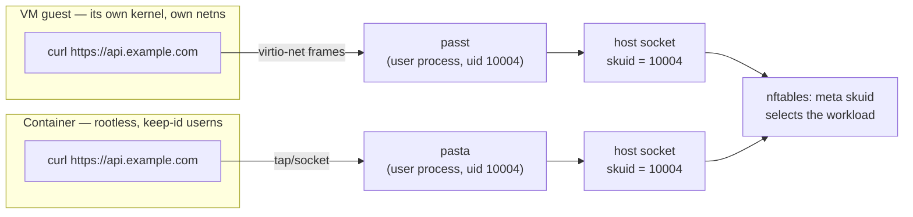
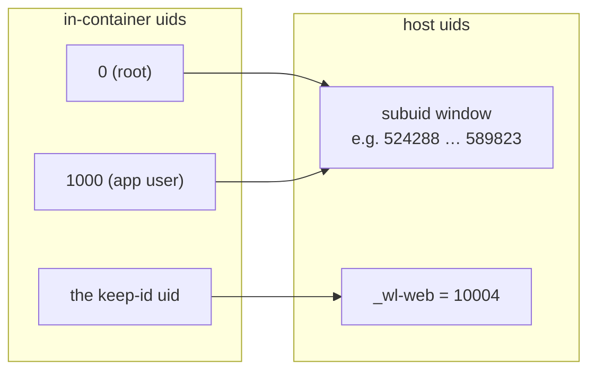
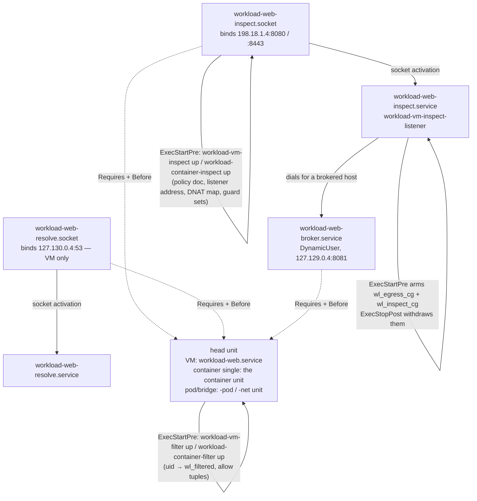
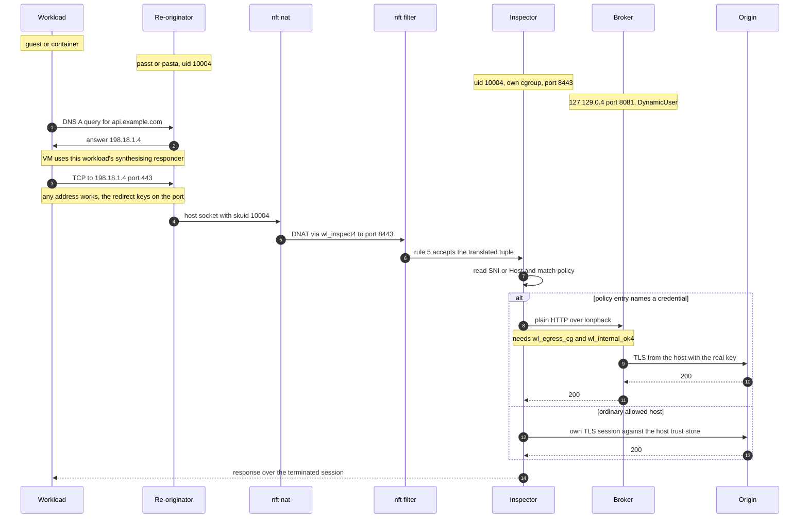
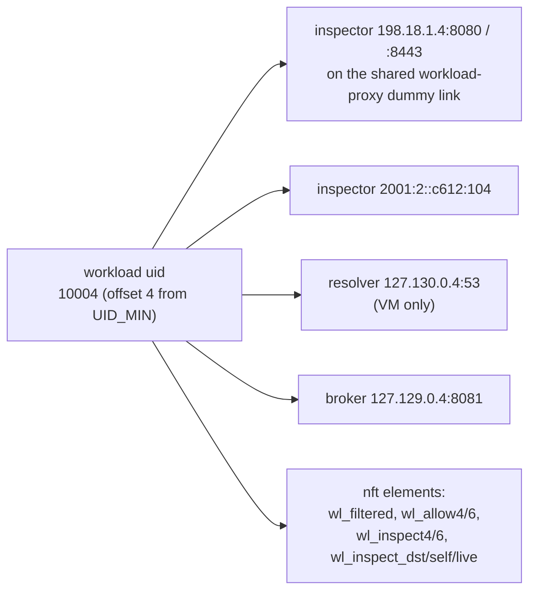
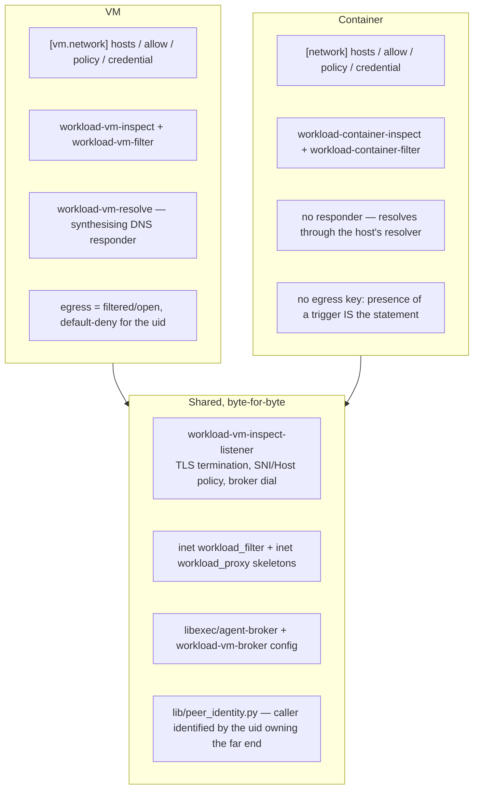
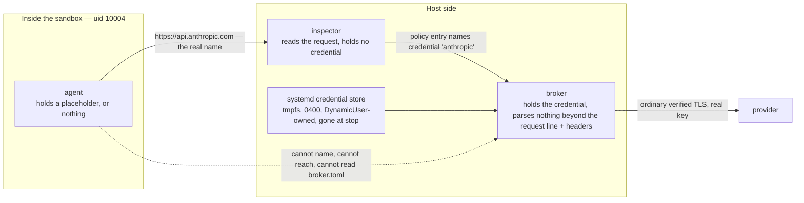

# How inspection and brokering fit together

Two host-side programs sit between a workload and the network: the **egress
inspector**, which decides whether a request may go out, and the **credential
broker**, which attaches a secret the workload was never given. This document
is the picture of how they attach to the two substrates — a VM behind passt and
a rootless container behind pasta — and why the same code serves both.

The reference material it condenses: [ADR 006](adr/006-vm-networking-passt-not-managed-bridge.md)
(why passt, not a bridge), [ADR 008](adr/008-transparent-egress-inspection.md)
(why a transparent inspector, terminating by default),
[ADR 007](adr/007-per-workload-credential-broker.md) and
[the broker's own doc](agent-broker.md) (what the broker refuses to do),
[the VM walkthrough](vm-egress-walkthrough.md) (one filtered VM, end to end,
including the full nftables chain), and [workloads.md](workloads.md) for the
schema.

---

## 1. The one property everything rests on

**Every packet a workload emits leaves the host from a socket owned by that
workload's uid.** Nothing below works without it, and each substrate earns it a
different way.

The guest's own kernel stack terminates *inside* passt; passt re-originates each
flow as an ordinary host socket it owns. pasta is the same program in its
container-side mode. So `meta skuid 10004` is a complete and unforgeable
per-workload selector — the guest cannot produce a packet that leaves the host
without wearing the workload uid.

**Where it does not hold**, and why those shapes are refused rather than quietly
half-filtered:

| shape | uid attribution | outcome |
|---|---|---|
| VM with `[vm.network].bridge` | none — the guest sends from its own LAN address, nothing of ours in the path | `egress`/`allow`/`hosts` are a validation error |
| container with `[network] mode = "host"` | partial and image-dependent — see below | never inspected; `container_uses_inspect()` returns false |
| VM `passt` (default) | exact | inspected |
| container `pasta` / `bridge` mode | exact | inspected |

### The user-namespace detail that excludes host mode

Under the default `userns = "keep-id"`, **exactly one in-container uid maps to
the workload uid**. In-container root and every other user map into the
workload's 65536-wide *subuid* window instead.

With pasta or bridge mode this does not matter: whatever the in-container uid,
the traffic is re-originated by a **host** process owned by `_wl-web`, so every
flow presents uid 10004. On the host network there is no re-originator — the
container's own sockets are the host's sockets — so a container running as image
root would emit from a subuid and match no selector. Filtering there would cover
only bundles that happen to run as the keep-id uid, which is an image detail
rather than a policy decision, so host mode is excluded outright. (Measured on
hardware: the host's own root and uid-1000 traffic is *not* dragged into a
workload's policy even with the netns shared — the failure is under-coverage,
not over-coverage.)

---

## 2. Units: what exists, and what starts what

For a workload named `web` at uid 10004 with an inspection trigger and a
credential:

Three ordering facts that have each cost a real defect:

- **`Before=` orders a unit; it does not start one.** The broker unit was once
  generated, correctly ordered, given its exemptions — and pulled in by nothing.
  Forty-five unit tests passed while the feature did nothing. It needs a
  `Requires=`-shaped pull from the head unit.
- **The head unit is not the umbrella in pod/bridge mode.** The umbrella is
  `After=` its members, so arming there would run only once every container was
  already up, leaving the whole of member startup unfiltered. Arming (and the
  broker's ordering) attaches to the pod-create / network-create head unit.
- **The two cgroup exemptions belong to the listener *service*, not the
  socket.** An nft element resolves a cgroup path to an id at add time, and
  systemd makes a fresh cgroup on every start — at socket-prestart time the
  service has no cgroup to resolve.

---

## 3. A request, end to end

Reading the diagram against the mechanisms:

- **The workload is never told anything.** No proxy variable, no broker address,
  no resolver of its own choosing. The redirect does not ask, so an agent that
  ignores its whole environment is inspected anyway. This is the difference
  between an inspector and a CONNECT proxy.
- **The inspector runs as the workload's own uid on purpose**, so `meta skuid`
  cannot separate its re-originated traffic from the guest's. The **control
  group** is the discriminator that survives the shared uid: systemd assigns it,
  a guest can neither enter nor forge it, and the exemption widens no
  destination and no port.
- **A brokered host is never dialled at the origin.** The inspector's dial goes
  to loopback only — so origin reachability is not a prerequisite for a brokered
  request, and no `allow` entry is owed for the provider.
- **The broker's own address needs an explicit exemption.** `127.129.x.y` is
  inside 127/8, hence inside `wl_internal4`, and the cgroup-keyed drop that stops
  a workload reaching host-internal ranges sits above the rule accepting the
  inspector's loopback traffic. Without `wl_internal_ok4` the dial is dropped in
  silence and presents as a dead broker.

For the full 19-rule output chain and the refusal paths (dial by literal,
unlisted host, non-HTTP on 443), see [the VM walkthrough](vm-egress-walkthrough.md).

---

## 4. Addressing: everything is derived from the uid

No registry, no allocator, no collision handling — uniqueness is inherited from
the uid allocator that already exists.

Two consequences worth holding onto:

- **The listener ranges are loopback and non-routable on purpose.** Isolation
  between workloads is the address family itself, not a rule — a routable
  listener range would silently reopen cross-workload reach. The guard sets
  `wl_inspect_live`/`wl_inspect_live6` exist because any local uid could
  otherwise dial another workload's inspector and pollute its records.
- **Two constants must agree** across three files: the broker's
  `listen_address`/`listen_port`, what the generator renders into `broker.toml`,
  and what the inspector dials (`vm_broker_listen_address` /
  `VM_BROKER_INSTANCE_PORT` in `lib/vm.py`). A mismatch presents exactly as the
  broker being down — connection refused, no log line anywhere.

---

## 5. One mechanism, two substrates

The container path is the VM path with substitutions, not a parallel
implementation. The listener binary and both nft tables are shared verbatim; the
uid-keyed element builders take nothing but a uid.

The genuine differences:

| | VM | Container |
|---|---|---|
| re-originator | passt | pasta (or the bridge-mode equivalent) |
| arming helper | `workload-vm-inspect` / `-filter` | `workload-container-inspect` / `-filter` |
| DNS | per-workload synthesising responder on `127.130.x.y`; answers every A/AAAA with the inspector address and has no upstream socket at all | none; the host's resolver answers, and a `[network]` trigger drops port 53 unless that resolver is on loopback |
| turning it on | `egress = "filtered"` (stated explicitly; there is no safe default) plus a trigger | any one of `hosts`, `[[allow]]`, `[[policy]]` |
| default deny | yes, keyed on the uid | no — the triggers are the whole statement |
| schema | `[vm.network].*` | `[network].*` |
| broker ordering | before `workload-<name>.service` | before the pod/net head unit in pod and bridge mode |

Both substrates read the *same* policy document shape and run the same listener,
which is why the brokered path needed one implementation and two arming scripts.

---

## 6. Why the credential never enters the workload

The split of labour is the reason this is ~600 lines and not a TLS-rewriting
middlebox: **authorising a request** (a host, a method, a path) and **rewriting
it to carry a credential** (per-provider auth schemes, key in hand, parsing
guest-controlled bytes) are different jobs, and they live in different programs.

Properties that follow from the picture, each of which is load-bearing:

- The workload has **no endpoint, no variable and no name** for the broker, so
  it cannot decline to use one or be pointed at another workload's. A base-URL
  environment variable would be exactly the step an attacker-influenced agent
  can undo.
- Callers are identified by **the uid owning the far end of the connection**
  (`lib/peer_identity.py`, shared with the inspector's listener). One instance
  per workload, so the uid is an assertion rather than a route: a resolved
  caller that is not the configured one is a 403 on a connection that should
  have been impossible to open.
- **One instance per workload.** N sandboxes sharing one broker with N different
  keys means one bug leaks all N.
- The broker is **not a general proxy**: upstreams come from config and never
  from the request; absolute-form request targets are a 400; a `Host` naming no
  row is a 403. The guest picks among rows the host wrote.
- **The workload uid cannot read its own `broker.toml`.** The instance runs as a
  dynamic user disjoint from `_wl-<name>`, and the file names the seal — which is
  the one thing between a workload and asking systemd for the material.
- The upstream leg **is not attributable to the sandbox**: the broker egresses as
  its own dynamic user outside the workload uid range, so the connection-marking
  rule does not tag it and per-workload packet capture will not show that half.

What none of this closes: the agent talks to a model provider by design, and can
write anything it can read into a prompt. After a network boundary exists, **the
mount set is the real secret boundary** — egress is mediated and scoped, a
filesystem passthrough is not.

---

## 7. Failure shapes to recognise

Each of these was found on hardware after a fully green unit suite; they share a
shape, which is that the wiring between two correct halves belongs to neither.

| symptom | cause |
|---|---|
| brokered request never reaches the broker; the origin is dialled instead | a terminated session seeded the upstream pool with the *origin* connection |
| broker dial refused, no log line on either side | the broker's `127.129.x.y` is inside `wl_internal4` and needs the `wl_internal_ok4` exemption |
| every unit active, feature inert | a generated unit that nothing `Requires=` — `Before=` orders, it does not start |
| 401 on a fully authorised request | the rendered config could not name the provider's `auth_header`/`auth_format` |
| workload unfiltered for the whole of member startup | arming attached to the umbrella, which is `After=` its members |
| container resolves nothing once a `[network]` trigger is added | port 53 is dropped unless the host's resolver is on loopback |
| `403` that names the host, on a host you did list | `hosts` patterns are fnmatch, not DNS suffix — `*.example.com` does not cover the apex |

Diagnostics: `workloadctl egress <name>` for the per-request record,
`workloadctl rules <name>` for what the workload is allowed to do, and
`workloadctl diagnose <name>` for the runtime setup.
